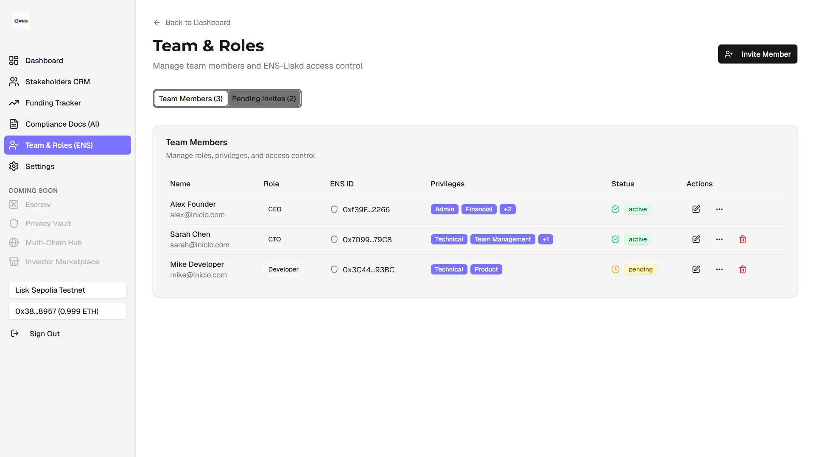

# Inicio - Stakeholder Management Platform
[Pitch Deck](https://docs.google.com/presentation/d/1tuXAihf2nlqIBGD8T9focEzE0Tk2vcUFiYZa-q0LhFs/edit?usp=sharing )

🌐[Live link](https://inicio-crm.vercel.app/)

A Web3-native platform for startup founders to manage stakeholders, track funding, and handle compliance documentation.

## Key Features

### 📊 Smart Dashboard
- Centralized view of startup metrics
- Real-time blockchain data integration
- Quick access to all platform features

### 👥 Stakeholder CRM
- Track investors, mentors, and team relationships
- Organize stakeholder information
- Monitor engagement metrics

### 💰 Funding Tracker
- Monitor funding milestones
- Track investor relationships
- Blockchain-verified transactions

### 📝 AI-Powered Compliance
- Generate legal documents with AI
- Blockchain document verification
- Automated compliance checks

### 👥 Team & Roles (ENS)
- ENS-based role management
- Secure access control
- Team collaboration tools
- Save startup details on chain (Lisk)

## Tech Stack

Built with modern Web3 technologies:
- Next.js 15
- RainbowKit & Wagmi
- Tailwind CSS
- shadcn/ui components
- v0 url 
`
npx shadcn@latest add "https://v0.app/chat/b/b_yBzxaGfyxAb?token=eyJhbGciOiJkaXIiLCJlbmMiOiJBMjU2R0NNIn0..qYuYE837OI-DYspU.EfSzeNuDoIpFWol2rFchdQgT7lwdzRW9iewJM_mClpv0TRxCqzr3XVI71R8.h3b3os2MwwhNQJOT_W38cA"
`

- ✅ **Contract Hot Reload**: Your frontend auto-adapts to your smart contract as you edit it.
- 🪝 **[Custom hooks](https://docs.scaffoldeth.io/hooks/)**: Collection of React hooks wrapper around [wagmi](https://wagmi.sh/) to simplify interactions with smart contracts with typescript autocompletion.
- 🧱 [**Components**](https://docs.scaffoldeth.io/components/): Collection of common web3 components to quickly build your frontend.
- 🔥 **Burner Wallet & Local Faucet**: Quickly test your application with a burner wallet and local faucet.
- 🔐 **Integration with Wallet Providers**: Connect to different wallet providers and interact with the Ethereum network.

